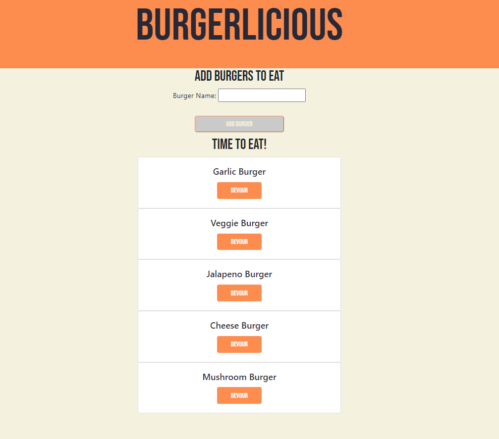

# Burgerlicious
---
## Table of Contents

* [Description](#description)
* [Installation](#installation)
* [Use](#use)
* [Contributions](#contributions)
* [Testing](#testing)
* [Images](#images)
* [Links](#links)
* [Questions](#questions)

## Description
This project allows users to add burgers to a menu and select to eat them.

## Installation
Clone the repository onto your local computer. Be sure you have MySQLWorkbench downloaded and your MySQL password to the connection.js to ensure they're working together. 

## Use
Run schema and seeds in your MySQLWorkbench. Run node server.js in your terminal and then add and devour burgers as you'd like. 

## Contributions
For future contributions push all changes to a separate branch and request the repository owner and a reviewer on all change requests.

## Testing
To test this project use the command "node server.js" if any errors occur, you will be able to view it in the console log. Please inform the repository owner of any errors.

## Images

## Links
- Repository Link: https://github.com/arianaw15/Burgerlicious
- Deployed Site: https://arianaw15.github.io/Burgerlicious/
## Questions
Contact the following with any additional questions:
- Git Hub Profile: https://github.com/arianaw15
- Email: arianaw15@gmail.com

